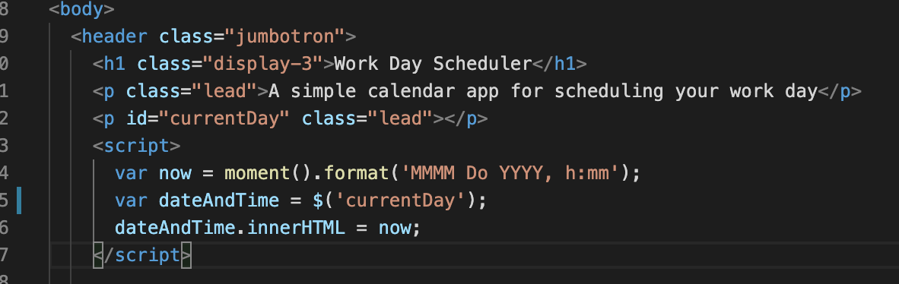
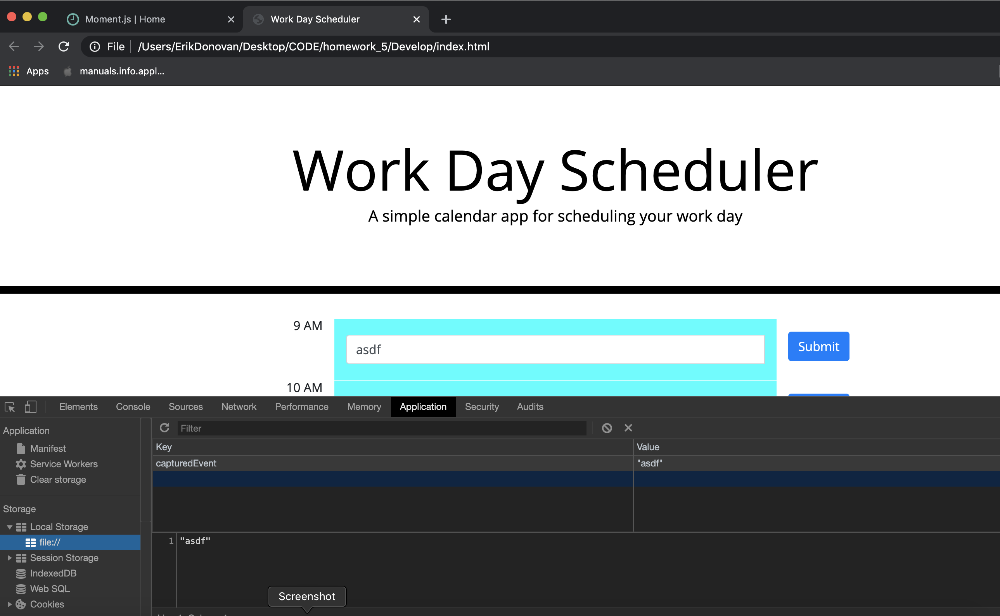
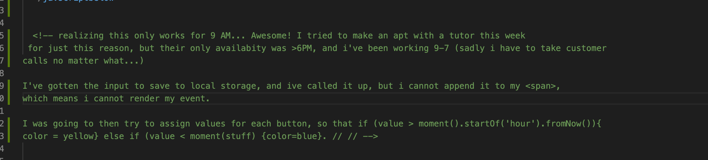
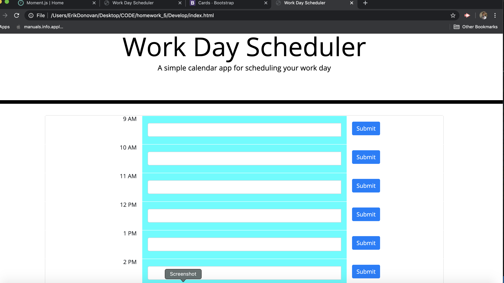

This webpage will be a basic calender, where you can:

- see what day and time it is. 
-see as set number of timeblocks for standard buisness hours
-each time block is color coded to indicate wheter it is in the past, present or future
-you can enter and save an event

The first thing i did was copy the js from moment-js and createa  js file, so that my webpage could use the API's info. 

I've made it so that you can see what day and time it is. At least i did that!! 

here is a picture of the code for it 

I was able to get my javascript to push items to the local storage, see below...

I was also able to console log newEvent at some point, after getting it from local storage, but now that is not working. 

Please see my explanation for the different color times: 

'

Here is a photo of my overall website:

